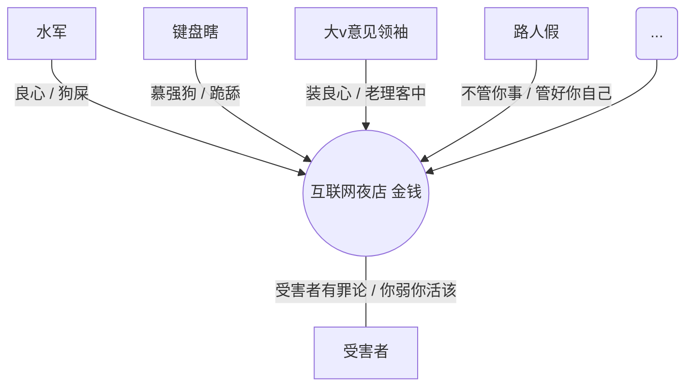
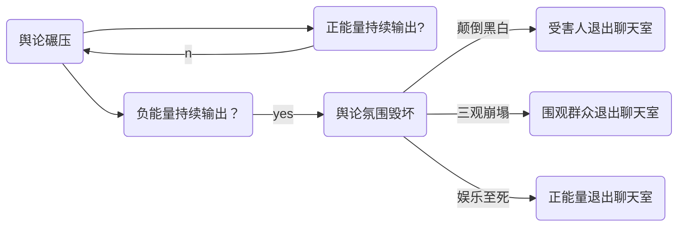

#### `第5疑`

当「弱者」更乐于践踏「弱者」，谁在改写道德准则？

强权者总是剥削和践踏弱者，包括他们的权利、财富、人身安全。这是强权的天性，也是人性中至恶一面。在道德和法律的共同作用下，对强权和强权者加以限制，这是人类社会步入现代文明后的必然要求。

强权与强权者基于本性和利益，则巴不得瓦解这一要求，并从破坏道德和法律的作用开始。

比较尴尬的是作为弱势群体的99%，往往会自觉不自觉地配合演出，瓦解自己和消灭自己。

原因如下：

a）因为向往强权而衍生出根深蒂固的强权崇拜；

b）目光短浅和利益熏心。实际上是由利益熏心导致了目光短浅；

c）动物性。简言之人类天生具有服从性，而动物的服从性是对力量的服从，力量服从直接演绎为弱肉强食的森林法则。

人类的进步在于从思想上反抗这种基因里的服从性，反抗森林法则，并通过平衡人类社会中的强弱来实现。但是十之八九又因为贪欲陷入对力量的向往，从社会学来说就是对强权力的向往，每个人巴不得凌驾于他人，站在金字塔顶端。

于是从文明诞生那一天，人类社会就是金字塔结构。

人类要想真正获得解放必然是彻底破除金字塔式社会结构。（因无关本篇宏旨，在此不作阐述，可参见拙作《大红窄门·力量》）

人们先是陷入对力量的向往，接着就会迷恋力量，追求力量的过程就是服从力量的过程。

渐渐的人群对力量的服从性，达到盲目与极致，便根植成奴性。

奴性的基本特点：软弱，对强权崇拜，对弱者鄙弃，对道德厌恶，浅见以及自私。具备奴性的人更容易对弱者施暴，因为他们服从强者，一方面顺从了远古基因，一方面又违反了作为高级生命精神层面的反抗性，这样，他们只有通过加倍凌虐更弱者，从更弱者身上找补回来心理落差。这就是典型的软弱者的自我心理补偿。

强者不一定是强权力的拥有者，现实中站在金字塔顶端的人物，但一定是精神力量强大的人。这种精神力量强大到几乎从基因层面消灭了服从性，消灭了奴性，所以古往今来我们赞美的真正强者，都是骨头最硬，最具风骨，最有反抗精神和平等精神的人。

只有自由的灵魂，不受欲望束缚，胸怀大仁大爱，才能脱俗。他们喜欢平等胜过阶级；喜欢解放胜过奴役，并因此拥有强大而完美的质疑和反抗精神。

拥有这样精神力量的人，无论本身什么处境，都会与堕落、霸陵、沉溺、糜烂等精神黑暗面绝缘。

小结一下，弱者首先是精神上极具奴性，其次往往伴随身份处境较低，渴望改变但无法改变，因而是常怀愤怒怨恨的人群。真正的强者无论身份怎样，即使身在黑暗，也向往光明。精神层次的不同，导致人格表现不同。强者极具人性光辉，弱者反之。这就是为什么一直以来，强者只会挑战更强者，弱者永远朝着比自己更弱的人下手。

再次回到鲍案、央美案、李依依案、雷闯案，那些已曝光的院长、校长、行长、书记、代表、企业家等。

这些案件一出，部分舆论表现出的共同点是丝毫不具备同情心，共情感，评论区的“键盘瞎”们罔顾公理，张嘴喷粪，肆无忌惮地炮制受害者有罪论，或张嘴就污蔑受害者“仙人跳”、“碰瓷”、“炒作”、“心怀不可告人目的”；除收钱的水军以外，自带干粮为加害者辩护洗地才叫匪夷所思。

我仿佛看见躲在电脑后面这一批懦弱的人群，他们只图将自身怨气疯狂发泄在受害者身上，践踏受害者让他们有一种践踏的快感，以及跪舔强者（在任何一起案件中，加害者无疑是相对强势的一方），让他们深心深处脆弱卑贱的奴性达到微妙的满足感。

假如我们不加以详察，很容易给这群人下一个定义：反社会人格，心理变态。

一旦加以详察，那么恐怕世界上没有那么多平白无故的变态和反社会，实际上中国互联网舆论氛围的崩塌，刚开始是由于水军的兴起，他们罔顾事实和良知，只要能为金主洗地，转移视线或打压受害者，那么泼脏水、污名化、造谣倒逼舆论等等，他们都无所不用其极，怎么能行怎么来。再贴滚贴造成围观效应，跟随效应，舆论场成了他们的狩猎场，搞得多了终于让舆论质量每况愈下。接着，有一批网友为博取眼球步步跟进，仿效水军的无下限和无底线，但求标新立异，哗众取宠。

人们为了名利，将互联网当作夜店，在光怪陆离的气氛下群魔乱舞，贩卖精神毒品，消费大众的良知。有意无意的，结果是欺骗洗脑了一部分人；诱发了一部分人，释放出人性恶的一面。他们将软弱和无耻化作舆论暴力，欺凌那些受害者，有一种生死予夺的践踏的快感。

于是大批自觉不自觉的负能量言论，控制了舆论场，压抑了人群的正义感。最后积重难返，达到今天这样一种地步。

今天的中国互联网上，除了冷漠麻木的看客外，就只剩下娱乐至死，而积极发声还能具有影响力的声音多半都是不经之谈，也就是俗称的三观歪了，这些声音还不是一般歪，而是集体崩塌和下滑。有句舆论场现状的笑话叫做：**正能量的声音孤军奋战，负能量的抱团点赞。**

那么回到章标题，谁在刻意创造和引导这样的互联网舆论氛围？我可以回答，金钱在作祟。

首先资本，其次水军，资本钱给够，水军就没有不能出卖的三观和底线；再次是强权崇拜的脑残，跟在资本和资本的走狗后面摇旗呐喊。

毫无疑问，一个拜金社会，必然造就出一个由金钱引导价值观的时代。过份追求经济建设，一味地钻进钱眼里，人人趋利而忘义，后果就是精神文明成为鸡肋和口号。没有精神文明这道高墙，钱对社会人心的腐蚀就是方方面面的。钱权色，自古以来三位一体。

所以，从钱的腐败到思想腐败再到色的交易与泛滥，社会风气浑浊之后，人们便不再洁身自好。近些年强奸案高发（相比前三十年），不过是一些人三观歪了以后带来做人底线下降，人心和社会道德败坏到一定程度，必然发生的现象。

杨光毅残忍奸杀十岁百香果女孩，二审由死刑改判死缓；雷闯假公益之名强奸妇女不了了之；与鲍毓明同样是上市公司高管的王振华猥亵儿童，至今没有开庭；被多名学生举报猥亵性骚扰的央美姚教授，网友喊打了几天，不了了之，别说立案，连个单位处理结果都没有。

不是这些案件令人们不服，而是它们发生之后，法律的毫无作为或者“罚酒三杯”式不痛不痒的判罚，令人张口结舌。比如改判杨光毅；比如庆阳吴永厚猥亵李依依不予立案，李依依长期受困猥亵阴影带来的心理创伤，终于跳楼身亡，吴才判了两年。比如李星星前几次报案，公安同样不予立案。

假如我们仍然觉得吴永厚是罪有应得，那么我提醒你，他这轻轻飘飘的两年却是用一条鲜活的生命换来。

假如我们仍然庆幸鲍毓明终被立案，那么我提醒你，鲍毓明的跌倒是李星星命大没有被办案人员掐脖子掐死，而且她的案件在舆论上发了酵。

假如吴永厚一开始就关起来，判起来呢？李依依的生命没有假如，当初公安放过吴永厚的理由却是轻描淡写，因为猥亵情节较轻。

是呀，养狼就是这样的，每个酿成大案的魔鬼，他们第一次伸手都小心翼翼，只是摸一摸，舔一舔，试一试，发现自己不受任何惩罚之后，胆子就越来越大。于是吴某之流放回去以后，很可能不但不收敛，还向更多女学生下手，说不得最终从猥亵发展到强奸。

鲍毓明第一次从公安局把报案告他的李星星领回家以后，只会更加胆子壮，有恃无恐。于是变本加厉，据说在李星星生理期，他都不放过。

我们的立法思路可能是非到酿成惨案不可，受害事实形成不可，否则法律就是摆设。这样的法律不但潜在受害者思维缺失，预防犯罪的盾的作用缺失，它作为审判之矛也是银样镴枪头。

难道法律不应该在一些人第一次伸手时就把犯罪的星星之火掐灭在萌芽阶段吗？

难道法律不应该在东窗事发后严厉判处以给受害人交代和潜在犯罪份子震慑吗？

所以改判杨光毅，从轻发落吴永厚，不了了之雷闯、姚教授、王振华……这些算什么操作？作为围观群众，从主观感受上判断，人们看到的就是连法律也似乎更乐意践踏弱者，甚至在养狼。

法律的执行者和制定者难道有毛病，还是法律本身出了什么毛病？现在我们来解释——

法律是强制社会公约。

任何社会公约都是建立在公共道德、人群共识、以及主体文化基础之上的。

我们常说三观，三观其实并不仅仅属于个人，比如说你的三观和我相同，我们都认同同情和保护弱者，当相同三观在人群中放大以后，就形成了全社会的通识共识。这就不再是个人三观，而应该是社会三观。

现在有些人的三观反过来了，开始有一个人说弱者有罪，后来跟随的人越来越多，竟成主流共识，这就叫社会三观颠倒（或者崩塌），社会三观崩塌体现在法律上就是法律的弱者倾向改变。

今天是百香果女孩，李星星，李依依，下次不管是谁，当法律渐渐不再倾向于同情弱者，而在悄悄维护强者时，鲍毓明也好，李国华也好，杨光毅也好，雷闯、梁岗、姚教授也好，判不了或隔靴搔痒式轻判，将成为常态。

这就是雪崩效应，雪崩之下，没有一片雪花是无辜的。